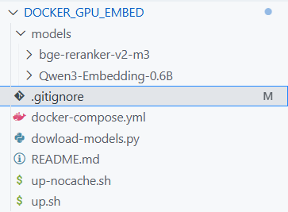

# docker-service

* **Download** 2 models at `dowload-models.py`:

> **Examples**:
> 

* **Deployment**

```bash
bash up.sh # or bash up-bocache.sh
```

* **Result:**

```bash
user@MSI MINGW64 /d/PY/Code/docker-service (main)
$ bash up.sh
🛑 Stopping and removing containers, networks, volumes...
🚀 Building with cache...
time="2026-03-09T14:58:31+07:00" level=warning msg="No services to build"
🔼 Starting containers...
[+] up 25/27
[+] up 27/27m/vllm-openai:latest [⣿⣿⣿⣿⣿⣿⣿⣿⣿⣿⣿⣿⣄⣿⣿⣿⣿⣿⣿⣿⣿⣿⣿⣿⣿⣿] 6.543GB / 9.268GB Pulling                                                                                                                                                   3
[+] up 29/29m/vllm-openai:latest Pulled                                                                                                                                                                                             649.1s 
 ✔ Image vllm/vllm-openai:latest  Pulled                                                                                                                                                                                            649.1s 
 ✔ Network docker-service_default Created                                                                                                                                                                                             0.1s 
 ✔ Container vllm-qwen3-embedding Created                                                                                                                                                                                             0.7s 
📜 Showing logs...
```

---

```bash
docker model pull ai/qwen3:4B-UD-Q4_K_XL
```
